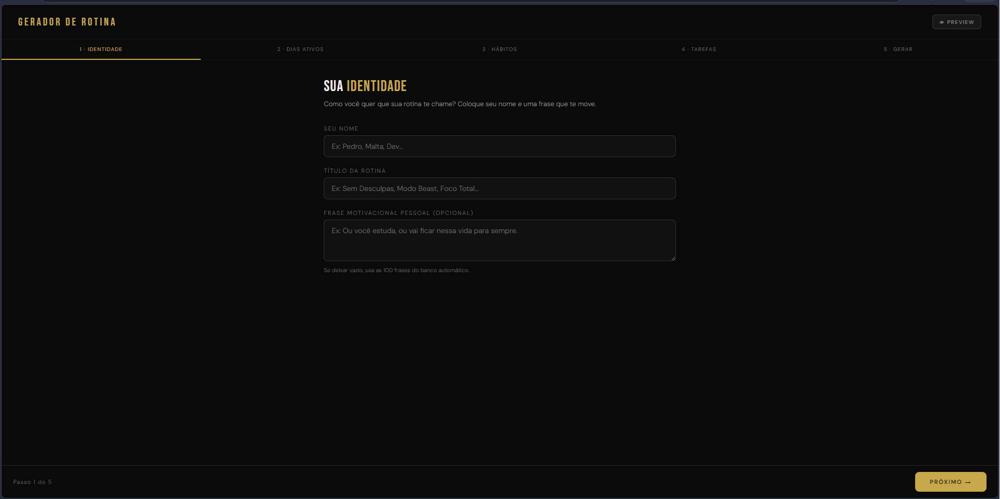
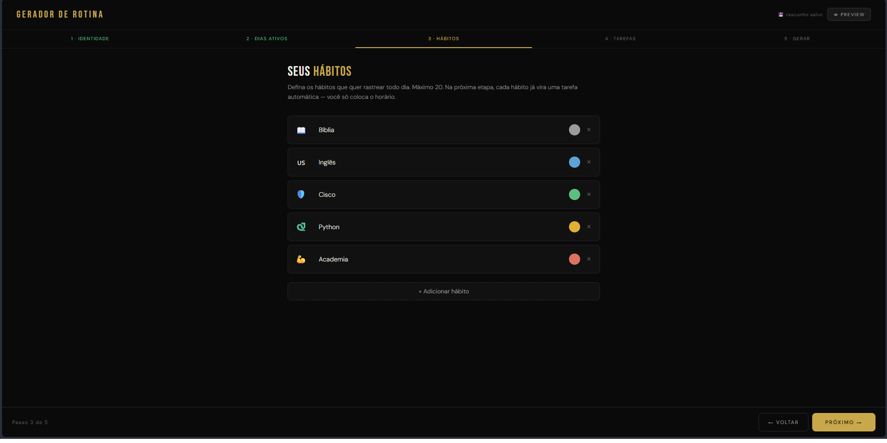
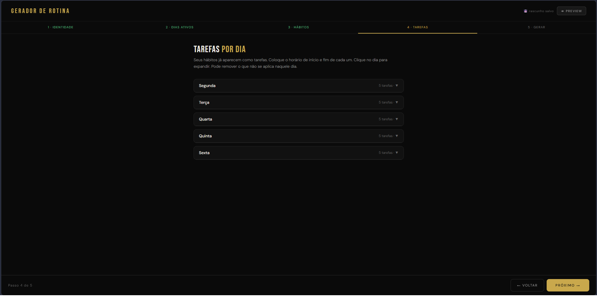
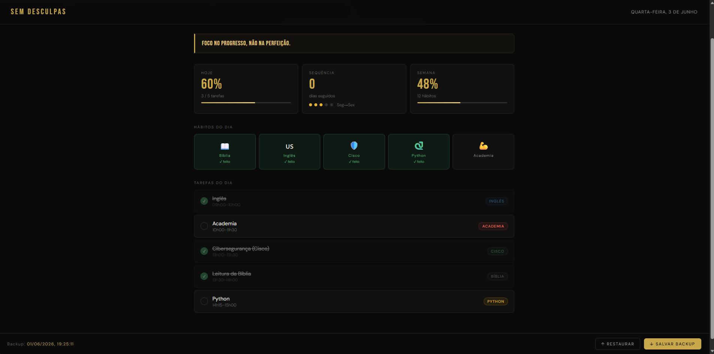

# Gerador de Rotina - Sem Desculpas

Aplicação web desenvolvida para auxiliar na organização da rotina diária, permitindo planejar atividades, acompanhar compromissos e manter uma rotina mais consistente.

## Sobre o Projeto

A ideia deste projeto surgiu da minha própria necessidade de organizar melhor meus horários de estudo, academia, leitura e outras atividades do dia a dia.

Em vez de depender de várias ferramentas diferentes, decidi criar uma solução simples que me permitisse visualizar e acompanhar minha rotina em um único lugar. Além de ser útil para minha organização pessoal, o projeto também serviu como uma oportunidade para praticar desenvolvimento web e colocar em prática conceitos aprendidos durante meus estudos.

## Funcionalidades

* Criação de rotinas personalizadas
* Organização de atividades por horário
* Acompanhamento das tarefas do dia
* Salvamento automático dos dados no navegador
* Interface simples, limpa e intuitiva

## Tecnologias Utilizadas

* HTML5
* CSS3
* JavaScript
* LocalStorage

## Demonstração

### Tela Inicial

Primeira tela da aplicação, onde o usuário pode começar a montar sua rotina personalizada.

### Cadastro de Atividades

Área destinada ao cadastro e organização das atividades do dia.

### Planejamento da Rotina

Visualização da rotina criada, permitindo uma visão clara dos horários e compromissos.

### Acompanhamento Diário

Tela utilizada para acompanhar as atividades programadas ao longo do dia.

### Visão Geral da Rotina

Resumo das informações cadastradas para facilitar o acompanhamento da rotina.

## O que aprendi com este projeto

Durante o desenvolvimento deste projeto tive a oportunidade de praticar:

* Estruturação de páginas utilizando HTML5
* Estilização com CSS3
* Manipulação do DOM com JavaScript
* Armazenamento de dados utilizando LocalStorage
* Organização e manutenção de código para aplicações web

Também utilizei ferramentas de inteligência artificial como apoio durante o desenvolvimento, principalmente para pesquisa, refinamento de funcionalidades e validação de ideias, mantendo sempre a responsabilidade pelos testes, ajustes e decisões finais do projeto.

## Como Executar

1. Faça o download ou clone este repositório.
2. Abra o arquivo `gerador.html` em seu navegador.
3. Configure sua rotina conforme sua necessidade.
4. Utilize `rotina.html` para acompanhar suas atividades.

## Próximas Melhorias

* Exportação e importação de rotinas em JSON
* Validação de horários conflitantes
* Separação do CSS e JavaScript em arquivos dedicados
* Melhorias de responsividade
* Novas opções de personalização

## Autor

**Paulo Henrique**

Projeto desenvolvido como parte da minha jornada de aprendizado em programação e desenvolvimento web.
